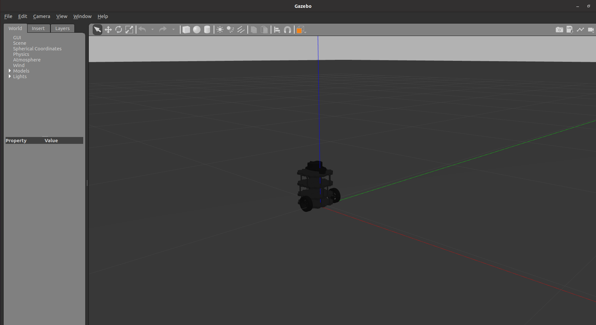
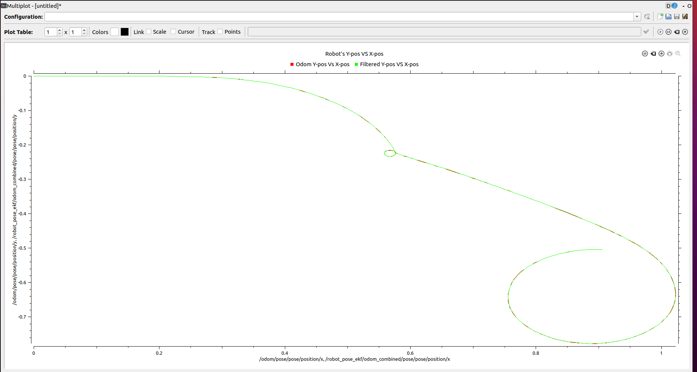

# Sensor Fusion using Extended Kalman Filter in ROS
This project employs sensor fusion using the EKF ROS package to localize the robot inside a Gazebo environment.

### Dependencies
- ROS Distro : [Noetic](http://wiki.ros.org/noetic)
- OS : [Ubuntu 20.04 LTS](https://releases.ubuntu.com/20.04/)
 

####  Perform a System Update/Upgrade
```sh
$ apt-get update
$ apt-get upgrade -y
```

Now, Clone this repository in `/src` of your ROS workspace
```sh
$ git clone https://github.com/Apatil10/SensorFusion-EKF.git
```

#### Edit the main.launch file
Under `/main/launch/` , edit the main.launch file:
```html
<node pkg="rviz" type="rviz" name="rviz" args="-d {update your absolute path for the EKF.rviz config file}"/>

Example: 
<node pkg="rviz" type="rviz" name="rviz" args="-d /home/aditya(user_name))/EKF_project(worksapce)/src/EKF.rviz"/>
```

#### Install Packages Dependancies
```sh
$ cd {your Catkin_workspace}
$ source devel/setup.bash
$ rosdep install --from-paths src --ignore-src --rosdistro noetic -y
```

#### Build the Packages
```sh
$ catkin_make
$ source devel/setup.bash
```

#### Launch the main file
```sh
$ roslaunch main main.launch
```
Now, you should see Gazebo and rviz launching. Please note that Gazebo might take up to 5 min to launch! 
<p align="center">

</p>


### End Result
In the terminal, use the keyboard commands(w-a-s-d-x-space.) and drive the robot around. The `red` trajectory represents the `Odom path` whereas the `green` trajectory represents the `EKF path`.


<p align="center">

</p>